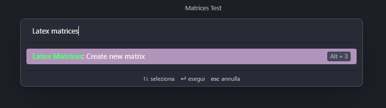

# Obsidian Latex Matrix

An obsidian plugin to create latex matrices.

It outputs an already formatted latex matrix to embed on your note, inside the $$ signs.
It supports all type of brackets and has built in latex fraction generation.

You can insert in the cells:
  - Fractions: {n}/{m}
  - Subscript: n_{m}
  - Superscript: n^{m}

---

## Example

This is an example note. It demonstrate that this plugin can output all types of matrices.

---

## Demo

To open the plugin's window, simply search for "Latex matrices" in the command palette.
You can also set up an hotkey.

This is the plugin's window, here you should insert the width, height and brackets type of your matrix, then click on "Generate Matrix".

Then you should see the creation of the matrix cells, each beign an input.
Insert in the cells your values and then press "Write latex".

*ATTENTION*: The output string should be encapsulated between 2 '$' signs. This does not happen automatically.

---

## Installation

For a manual installation, you can download the necessary files and place them within your plugins folder.

---

## Support

If you liked this plugin, please consider donating to support me and my work!

