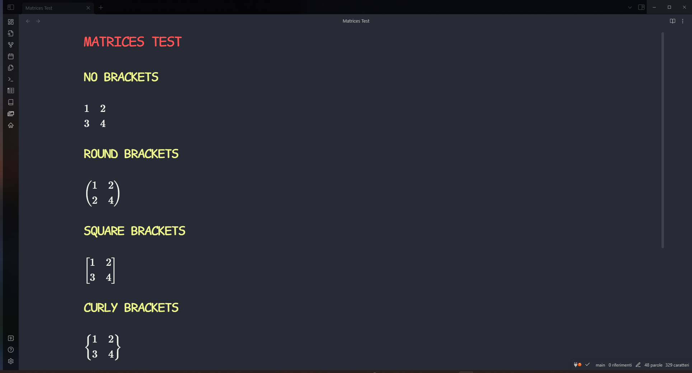

# Obsidian Latex Matrix

An obsidian plugin to create latex matrices.

It outputs an already formatted latex matrix to embed on your note, inside the $$ signs.
It supports all type of brackets and has built in latex fraction.

## Demo

## Installation

For a manual installation, you can download the necessary files and place them within your plugins folder.

## Support

If you liked this plugin, please consider donating to support me and my work!

[(https://www.paypal.com/paypalme/DanieleSus)]
